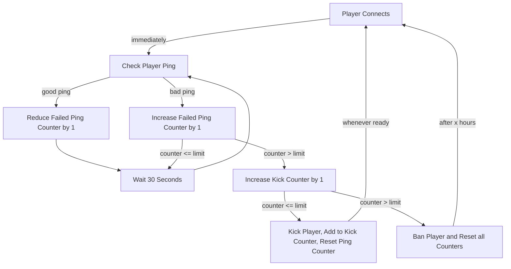

# High Ping Kicker

 

7 Days to Die Modlet: Automatically monitor and kick/ban players with excessively high ping

## Usage

> Even a single player with high ping can cause trouble for all other players - making pvp virtually impossible. Automatically removing players with consistently high ping can help to reduce errors/issues on the game server and improve the experience for everyone else.

### Compatibility

Environment | Compatible? | Details
--- | :---: | ---
Dedicated Server | Yes | This mod is meant for dedicated servers only
EAC | Yes | You can leave EAC enabled on your server and client (just be sure to only install this mod on the server)
P2P | No | Peer-to-peer multiplayer games are not the target of this mod
Local | No | Installing this mod on the client is not necessary; please only install it on your dedicated server

### Installation & Setup

The team over at [7daystodiemods.com](https://7daystodiemods.com) has put together [an excellent guide on how to install mods](https://7daystodiemods.com/how-to-install-7-days-to-die-mods/); just make sure to install this on your **server**, rather than your local game installation.

After restarting your game, the High Ping Kicker will be active with default settings. You can join the server or access it via Telnet (if enabled) to adjust the configuration options to meet your needs (see below).

### Commands

Command | Description
--- | ---
`highpingkicker` / `hpk` | View current configuration
`hpk set <Option> <Value>` | Update a key/value pair in the configuration
`hpk list` | Show list of players currently being tracked for high ping
`hpk reset` | Delete the configuration file and create a new one with default values

### Options

> TIP: *Ping limit will come preconfigured with a suggested value of 200ms, but this might naturally exclude some regions that you don't want to exclude... consider registering your server at [7 Days To Die Servers](https://7daystodie-servers.com) (an unofficial site for ranking and providing external tools for 7DTD servers) and view the Ping tab to get a rundown of ping tests from various parts of the world.*

`<Option>` | `<Value>` (Default) | Description
--- | :---: | ---
MaxPingAllowed | 200 | Threshold for latency in milliseconds. A ping check exceeding this number will be treated as a failure and increment the `PingFailures` counter. Good pings will reduce the counter while bad ping checks will increase it - giving players a sort of grace period for an intermittently poor connection (you can reduce/eliminate this grace period)
FailureThresholdBeforeKick | 2 | The number of times a player can fail a ping check before being kicked. Setting this value to `0` will cause the player to be kicked during login if their intial ping is too high, but will also mean that active players won't benefit from a grace period for the occasional spike in latency
AllowedKicksBeforeBan | 2 | The number of times a player can be kicked before the system resorts to a temporary ban. setting this to `0` will cause players to be auto-banned instead of kicked when the limit set by `FailureThresholdBeforeKick` is exceeded
HoursBannedAfterKickWarnings | 24 | The number of hours a player will be temporarily banned for if they continue to fail ping checks and have been kicked for the same reason too many times

## Code Flow

Once every 30 seconds or so, the system will check ping for each player.

The first ping check will happen at login. Subsequent ping checks will happen at 30-second intervals, give or take.

### Kicked

### Banned

Note: *ban timeout can be customized*

### Ban Reminder

Note: *ban timeout can be customized*

## Special Thanks

This mod is largely based on the feature by the same name in [Server Tools](https://github.com/dmustanger/7dtd-ServerTools). I would highly encourage anyone interested in *this* mod to check out their server management mod as well. It comes with a full suite of AntiCheat services and a truly wild number of tools and capabilities.

### Why not just use Server Tools?

Hey, using [Server Tools](https://github.com/dmustanger/7dtd-ServerTools) might be the better choice for you! But here are some reasons why you might not have the option to:

1. Accessibility: I found that my current host and many other hosts (it turns out) do not support the creation/management of xml files in the game root directory and instead rely on configuration via admin commands. In order to ensure accessibility and ease of use for all admins in any situation, **High Ping Kicker (this project) is fully configurable from the admin console or via Telnet**.
2. Compartmentalization: I'm a fan of keeping mods as small and as simple as possible, which aligns more to a 'microservices' line of thinking. There are some downsides to this, in certain situations, but monitoring/kicking players for excessive ping would not suffer from this approach in my view.
